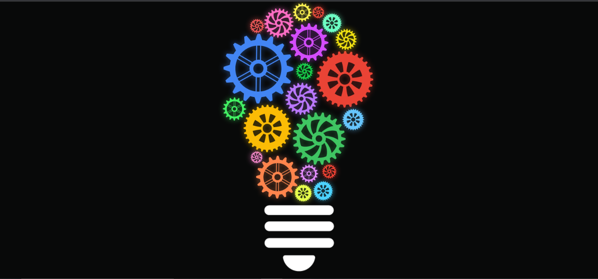
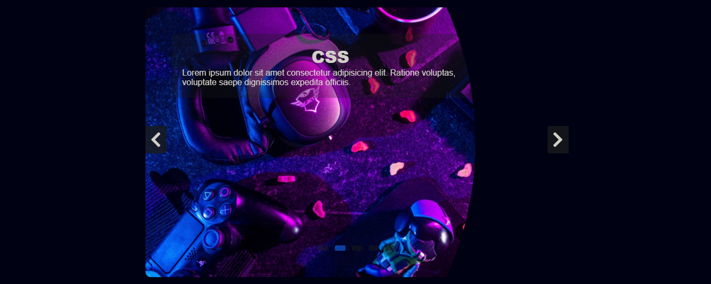
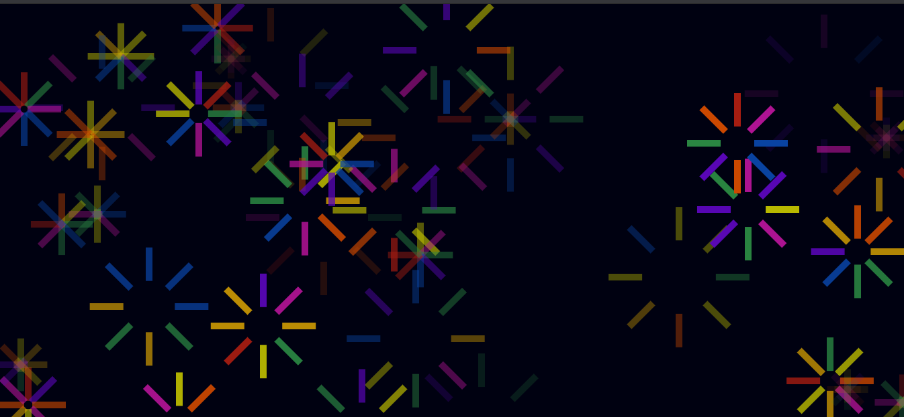

# Animated-Design 





# Project Title

### Animeted Design

## 1. Demo Website

- 👉 Netlify : https://anushkadesign.netlify.app/


## 2. You Will Learn
```
- HTML5, CSS3 & JavaScript.

- CSS Media Queries, CSS Animations, CSS transition.

- Bulb Circle Design (Mechines).

- Image Slider, Auto Slide, Bubble Effect.

- Use JS More Effects.

```

## 3. Clone repo

```
$ git@github.com:NileshShriwas/Animated-Design.git
$ cd Animated-Design
```
## 4. Run 
```
- Run this on chrome: http://192.168.142.77:5500/index.html

- You are use VS Code install Live Server (Extention) and Directly Run.